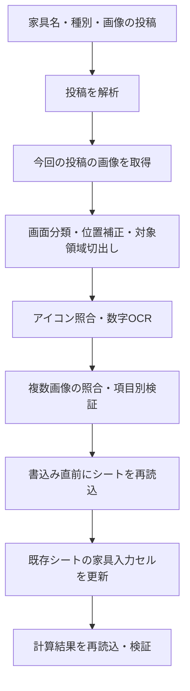

# 家具スクリーンショット自動入力・詳細設計

作成日: 2026-09-19（日本時間）

この文書は実装案。Botの本番コード、Discord、Google Sheets、Northflankの設定は本設計の作成時点では変更していない。

2026-09-19実装追記: ローカルに実装し、認識処理を `furniture-v8` へ改善。下記は目標を含む設計であり、全項目が実装済みという意味ではない。現在の実装範囲と差分は [運用手順](furniture-auto-input-operation.md)、拡充した実画像の実測値と未完了の検証は [検証結果](furniture-auto-input-verification.md) を参照。

2026-09-20改訂: 自動入力を投稿・編集イベント内で完結する方式へ変更。管理タブとBot側の永続保存は使用せず、履歴巡回・再起動復旧・自動再試行を廃止した。以下の保存・復旧に関する設計もこの方式へ更新した。

## 1. 目的と決定事項

メンバーが現在の家具スクショチャンネルへ投稿すると、投稿文・添付画像から取得できる情報を「家具データ入力シート」の対応行へ自動記入する。

- 家具名・家具種別は投稿文を使用する。
- レアリティ・テーマ・寮・既知の材料は画像のテンプレート照合を使う。
- 数字はBotの実行環境にインストールしたTesseractで読む。外部の画像認識APIは使わない。
- テーマグラフは解析しない。ポイントは既存のスプレッドシート数式で算出する。
- 新機能からDiscordへの結果返信・確認ボタン・エラー通知は送らない。
- 読めた項目だけ自動記入する。未知、判読不能、情報不足を0や「なし」に変換しない。
- 既存の手入力・公開済みデータを自動認識結果で上書きしない。
- マスターシートへの反映、計算機の公開、SNSへの投稿は本機能の対象外。

既存の `/tellme`、週次通知、GAS連携による済リアクションは現行機能として維持する。今回追加する認識処理は直接リアクションを付けない。

## 2. 確認した現状

対象リポジトリの確認時HEAD: `71006c61ddcb39614cc09754080b7d98e37d9e95`。

- `app/main.py`: discord.py 2.3.2、gspread 6.1.3、Googleサービスアカウントで稼働。
- 家具スクショ: `1290587266695036958`。GAS連携: `1297464731841597460`。
- 現状の画像投稿の転記はC列・H列のみ。画像内容の認識処理はない。
- 転記処理は「家具名：」形式を要求する一方、済管理には先頭行を家具名にする処理がある。両者を共通の投稿解析へ統一する。
- 現状の済管理は添付3～4件だけが対象。自動入力の受付は画像1枚以上へ拡張し、完了管理も同じ投稿定義に合わせる。
- Google Sheetsへの同期呼出しを `on_message` 内で行っている。同期I/Oと認識をイベントループ外で実行する。
- `app/sync_logic.py` は「未入力」「編集中」以外を完了としている。自動処理専用の状態文字列をB列に追加すると誤って済扱いになるため、B列の選択肢は増やさない。
- Northflankの確認時の稼働リソースは0.1 vCPU / 256MB。認識を載せた状態のメモリ・速度は未測定。
- Bot内にはテーマ5種類・一般素材9種類のPNGがある。実スクショとの一致、透明部分、縮尺、種類の網羅性を確認してからテンプレートへ採用する。
- ツイステツール側のOpenCV画像照合と数字OCRの方式を参考にする。ブラウザ用TypeScriptをBotへ丸ごと組み込まず、Pythonで家具画面に適した処理を作る。

## 3. 構成と処理順序



`on_message` と `on_raw_message_edit` から、そのイベント内で画像取得・認識・Google Sheetsへの更新まで処理する。プロセス内のロックで同時処理を直列化し、ジョブや結果は保存しない。CPU処理と同期のシートI/Oはイベントループ外へ移し、Discord接続を止めない。

新規投稿、投稿編集、同じ家具への明確な追加投稿を処理対象にする。リアクションの変更だけでは再認識しない。

## 4. 投稿の解析と家具の紐付け

受け付ける基本形式は、既存の投稿に合わせて次の2種類。

```text
グレート・ルック（ジャミル）
雑貨：衣装
```

```text
家具名：グレート・ルック（ジャミル）
雑貨：衣装
```

- 表示名は投稿の文字列を保ち、照合用キーは全角・半角、前後空白、連続空白を既存の規則で正規化する。
- 種別は既存15分類に完全一致する行を抽出する。
- `家具名：` があれば優先。接頭辞がない先頭行は、有効な分類行がある場合に家具名として採用する。ショップ情報・雑談だけの画像投稿を誤登録しない。
- 有効な家具名と分類が揃わない投稿は自動記入しない。分類だけをAIで推測しない。
- 中黒や①②、キャラ名、左右などは勝手に除去しない。完全一致しない類似名は自動記入せず、必要な対応だけ別名辞書へ登録する。
- 同名行が複数あれば書込みを保留する。最初の行や最後の行を無条件で採用しない。
- 投稿IDと家具の対応は保存しない。処理のたびに投稿の現在の家具名でC列を照合し、書込み直前にシートの変更を確認する。
- 投稿の改名前の名前は保持しない。名前を編集した場合は現在の名前で照合し、未登録なら新規家具として扱う。旧名の行を自動改名・削除しない。
- 同じ投稿の添付をまとめて認識する。返信画像や別投稿の画像との結合は行わない。同じ家具への追加投稿には家具名と分類を明記する。
- 異なる投稿の「いごこち度・シリーズボーナス・表示寮ポイント」は混ぜない。この3値は同一ステータス画像に由来する一組として保持する。

## 5. シート列と認識方式

対象: `家具データ入力シート`。B1:BF2の見出しを確認済み。投稿の処理時に列見出しを照合し、列構成の変更時は自動書込みを停止する。

| 列 | 項目 | 取得・処理 |
|---|---|---|
| B | 状態 | 新規は「未入力」。自動で「記入済」「公開済」にしない |
| C | 家具名 | 投稿文 |
| D | いごこち度合計 | ステータス画像の数字OCR |
| E | シリーズボーナス | 同じステータス画像の数字OCR。明確にボーナスなしなら0 |
| F | 表示寮ポイント | 同じステータス画像の数字OCR。家具の寮アイコンに対応する数値を選ぶ |
| G | レアリティ | R / SR / SSRの表示領域をテンプレート照合 |
| H | 分類 | 投稿文の既存15分類 |
| I | マス数 | 詳細画面の幅×高さを数字OCRし積を記入。適用しない分類は既存の入力規則に従う |
| J:M | 基礎・寮・テーマポイント | 数式を維持。認識値で上書きしない |
| N:O | テーマ1・2 | 詳細画面のアイコンを左から順に照合。1種類と確認できた場合のみOを「－」 |
| P | 寮 | 詳細画面のアイコンを照合。なしと確認できた場合のみ「なし」 |
| Q | 家具シリーズ | 第2段階。既知シリーズ表示の画像辞書、必要な場合だけ日本語OCR。未知は保留 |
| R | 作成可能数 | 作成上限・所持上限など画面の意味を確認した領域を数字OCR。所持数を転記しない |
| S:T | キャラ・家具モーション | 明示アイコン等で判定できる場合のみ。静止画像に写らない動作は推測しない |
| U | 製作マドル | 作成画面の必要マドルを数字OCR。所持マドルを転記しない |
| V:W | 作成／交換期限・素材収集期限 | 対応する表示のある画像だけを対象とする後続機能。別の期限を流用しない |
| X | 開放条件 | 第2段階。投稿の明示情報または対応画面から取得。見えなければ保留 |
| Y,AA,AC,AE,AG,AI,AK,AM,AO | 木・枝・石・鉱石・金属・ガラス・粘土・布・紙 | アイコン照合＋必要数の数字OCR |
| Z,AB,AD,AF,AH,AJ,AL,AN,AP | 上記のイベント素材名 | イベント用素材を通常素材と混同しない。名前の対応が未登録なら保留 |
| AQ:AU | スタイリッシュ・ベーシック・エレガント・ポップ・ユニーク素材欄 | 第2段階。素材画像の色・形と数量を対応付ける。画面サンプルで列の記入規約を検証 |
| AV:AX | 結晶R・SR・SSR | 第2段階。結晶用テンプレートで判定。家具自身のレアリティを流用しない |
| AY:AZ | 部活・マスターシェフメダル | 第2段階。対応アイコンと必要数 |
| BA:BF | イベント素材1～3と各名称 | 第2段階。登録済みイベント素材辞書と必要数。未知素材は確認候補へ |

「全入力項目」はこの列対応表を完成範囲とする。最初の実装はC～P、R、U、通常材料9種類を中心に行い、シリーズ名や特殊素材・期限等は根拠画像を揃えて追加する。初版で全列を認識できるとはしない。

## 6. 画像認識の詳細

### 6.1 前処理と画面分類

画像は1枚ずつ処理する。PNG / JPEG / WebPを初期対象とし、拡張子だけでなく実際にデコードできる形式を検証する。初期の保護上限案は画像15MB・1200万画素。サンプルに適合するか実測して調整し、上限を超えた画像は保留する。

画面の枠、作成／詳細タブ、いごこち度の表示枠などをアンカーとして画面を分類する。固定の絶対座標だけに依存せず、アンカーから相対座標で対象領域を求める。端末比率・余白・縮尺・切抜きの違いを処理する。アンカーが不足する画像は無理に別画面として扱わない。

画面種別は `craft`、`detail`、`status`、`placed`、`unknown`。設置画像は測定条件の補助証拠として使い、家具が写っているだけで基礎条件を満たすとは断定しない。

### 6.2 テンプレート照合

OpenCVの正規化相関等を使い、領域の大きさを合わせて複数テンプレートと比較する。

- レアリティはR/SR/SSRの文字を含むバッジ全体を比較。色だけで決めない。
- テーマは5種、寮は画面に登場する各種、一般素材は9種を辞書化する。
- 透過・背景部分を除くマスクを用意し、圧縮や表示サイズの違いを吸収する。
- 最高一致度、次点との差、領域位置の妥当性を項目ごとに判定する。
- 数値スコアをそのまま「正解確率」とは呼ばない。しきい値は正解付き画像で調整し、別の検証画像で誤認識を測る。
- テンプレートとレイアウト定義はコードと一緒に版管理する。Botは投稿ごとの認識結果を保存しない。

### 6.3 数字OCR

Tesseractをローカルの子プロセスとして実行し、言語データはイメージへ同梱する。初版は数字中心のため英語データと文字制限を使う。Python側はタイムアウト付きで呼び出す。

対象領域だけを拡大し、グレースケール・二値化など少数の前処理を試す。整数、`幅×高さ`、`所持数/上限`、`所持数/必要数`は別のパーサーにし、画面の左右関係とラベル領域から値の意味を判定する。

同じ画像への無制限な再試行は行わない。前処理を変えて結果が食い違う、数値が途中で切れている、必要数と所持数を区別できない場合は未確定とする。最初から数字0～9のテンプレート認識だけに置換せず、OCRを基準に検証し、安定する固定フォント領域から軽量化を検討する。

### 6.4 証拠の構造

認識器は直接シートを書き換えず、項目ごとに次の構造を返す。

```text
FieldEvidence:
  field: comfort_total | rarity | theme1 | ...
  state: recognized | explicit_none | unreadable | missing | conflict
  value: string | integer | null
  source_message_id, attachment_id, image_sha256
  screen_type, bounding_box
  method: post | template | numeric_ocr | rule
  raw_candidates, match_score, runner_up_margin
  parser_version, template_version, reason
```

「画像にない」「読めない」「明示的になし」は区別する。同じ家具の複数画像で矛盾する場合は多数決で決めず、その項目を保留する。正解が確定した手入力は認識候補より優先する。

## 7. 計算式と数値入力の扱い

実際にJ1869:M1869を確認した計算を仕様とする。行番号をnとした意味は次の通り。

```text
補正値 = 床・壁紙なら68、それ以外なら86
寮ポイントK = 原則F
  Pがナイトレイブンカレッジの場合:
    床・壁紙なら F - 27
    それ以外なら F - 36
基礎ポイントJ = D - E - K - 補正値
テーマ1ポイントL = Oが「－」ならJ、それ以外ならROUNDUP(J*2/3)
テーマ2ポイントM = Oが「－」なら空、それ以外ならROUNDDOWN(J/3)
```

例: グレート・ルック（ジャミル）はD=97、シリーズボーナスなし、F=5、P=スカラビア。J=6、L=4、M=2。

- 数値算出に必要なのはD・E・F・H・P。テーマの振分けにはN・Oとその順序が必要。レアリティはこの計算の入力ではない。
- ルームの床・壁と家具の配置は現在の撮影手順を前提とする。誤った測定条件を式が自動修正することはない。
- Eの0はボーナスなしと読めた場合、Fの0は寮なし等の条件が確定した場合だけ書く。
- ステータス画面に必要情報が揃わない場合、D・E・Fは書き込まず、候補も保存しない。認識できたG・N・O・P等は先に記入できる。
- 不完全なD・E・Fを継ぎ足して誤ったポイントを表示させないよう、数値3項目は同じ測定画像由来の一組で反映する。既存の一部手入力と候補が食い違う場合は数値組を保留する。
- J:Mの既存の確定値・個別修正式は維持する。全行の式を一括で置換しない。
- 新規登録用の行では、必要な入力が揃うまで空欄になるガードを付けた同等式を使用する。計算定数、切上げ・切下げ、テーマなし表記は既存式と一致させる。
- 名前のない行に式だけが入っている場合は、既知の式であることを確認した上で、新規家具用の空欄ガード付き式を適用する。
- 新規行は検証済みのテンプレートから入力規則・書式・式だけを用意する。他の家具の値はコピーしない。
- 計算後はJ:Mを再読込し、負数、数式エラー、テーマポイント合計とJの不一致などを検出する。異常は自動で丸めて修正せずその場の読戻し不一致として処理を終了する。

## 8. 書込みポリシー

初版は新規行の登録と、Bが「未入力」の既存行の空欄補完を行う。Bが「編集中」「記入済」「公開済」、空欄、その他の状態の既存行は更新しない。

| 書込み先の状態 | 動作 |
|---|---|
| 許可された未入力行の空欄、認識結果が確定 | 値を記入 |
| 既存値が認識結果と一致 | 変更しない |
| 既存値が異なる | 上書きしない（候補も保存しない） |
| 過去にBotが記入した値が異なる | 自動訂正しない |
| 未判読・情報不足 | 値を記入しない |
| 数式セル・保護対象・未知の入力規則 | 値を記入しない |

書込みは対象セルだけの `UpdateCellsRequest` を組み立てる。文字は `stringValue`、数値は `numberValue`、既知の式は `formulaValue` とし、投稿文を式として解釈させない。フィールドマスクで入力規則・既存書式・関係ないセルを維持する。

更新直前に家具名、B列状態、対象セルの値・式を再読込する。対象が変わっていれば再解決または保留する。書込み後も読戻す。

Sheetsの一括更新は複数の変更をまとめられるが、読取り時点の値を条件に更新するCASではない。直接編集する人との完全な排他にはならない。初版は単一のBot書込みプロセス、未入力行限定、編集開始時の「編集中」運用、短い更新区間で競合を抑える。無競合の保証が必要になった場合は、編集経路の統一や行保護を伴う別設計にする。

## 9. 保存しないイベント処理

- 管理タブ、DB、ジョブファイル、処理済みID一覧、認識結果キャッシュを作らない。
- 画像、認識値、更新計画は今回の処理中だけメモリに置く。認識器の固定テンプレートと接続オブジェクトは再利用する。
- 起動・再接続・定期タイマーで認識対象の過去投稿を回収しない。投稿・編集イベントの受信時にだけ実行する。
- 停止中の投稿やプロセス停止で中断した処理は自動復旧しない。必要ならメンバーが本文・画像を編集するか再投稿する。
- 通信失敗でも処理を保存・自動再送しない。応答喪失時は書込み済みの可能性があるため、次の投稿イベントでは改めて家具名と入力済みセルを確認する。
- 投稿削除・権限エラーでも既存の家具データを削除しない。
- 投稿ID・成否・項目数・例外の型だけを通常の実行ログに出す。本文、画像、候補値、根拠JSONは記録しない。
- 投稿の同時処理はプロセス内のロックで直列化する。分散ロックはなく、書込みBotは1プロセスで運用する。デプロイ時も旧・新Botの同時書込みを避ける。

## 10. メンバーに見える状態

- 読み取れた値が既存の家具入力行へ入る。未登録なら新規行へ追加する。
- B列は自動処理だけでは「未入力」のまま。確認後は既存の手順で「記入済」へ変更する。
- 新しい管理タブ、セルメモ、確認ボタン、Discordへの結果返信は追加しない。
- 未確定の値は空欄のまま。認識候補を別の場所へ保存しない。

APIからセルを書き換えてもGASの `onEdit` は起動しない。自動入力の完了処理はGAS通知へ依存させない。人が状態を変更した際の既存連携は維持する。

## 11. 実装構成

- `app/main.py`: 新規投稿・投稿編集イベントから自動入力を呼び出す。
- `app/furniture_input/service.py`: その場での画像取得、認識、投稿変更の確認。
- `app/furniture_input/store.py`: 既存入力シートの検査・空欄書込み・読戻し。処理状態の保存機能はない。
- `app/furniture_input/sheet_writer.py`: 家具名と入力済みセルから更新計画を作る。
- `app/furniture_input/recognizer.py`、`numeric_ocr.py`、`assets/`: ローカル画像認識。
- `scripts/analyze_furniture.py`、`verify_furniture_samples.py`: 運用者が明示的に実行するオフライン検証。Botはこれらの結果ファイルを使用しない。

`FURNITURE_AUTO_INPUT_MODE=off|dry_run|write`（既定は `off`）。`dry_run` は認識と計画作成までで、シートへの書込みも結果の保存もしない。その他の設定は[運用手順](furniture-auto-input-operation.md)を参照。

## 12. 検証と受入条件

### 認識精度

最初に正解付き20～30家具分を集める。これは方式の検証用であり、任意の家具に対する精度保証ではない。テンプレート・しきい値を作る画像と最終検証画像を分ける。

通常作成、ショップ交換、テーマ1種／2種、寮あり／なし、ナイトレイブンカレッジ、シリーズあり／なし、床・壁紙、一般家具、複数端末、圧縮・切抜きを含める。新規イベント素材は初版で無理に既知素材へ分類せず保留できることを確かめる。

項目ごとに、正しく自動記入した割合、誤記入した割合、保留の割合を分けて測る。合格条件は検証用データで自動記入対象の誤記入0件。数字の自動認識率を上げるために誤記入を許容しない。手作業時間の減少も測定する。

### データ保護とイベント処理

- 同じ投稿を複数回受け取っても行・値が重複しない。
- 書込み応答の喪失時に自動再送しない。次の投稿イベントではシートの既存値を再確認する。
- 起動だけで履歴を回収せず、DB・管理タブ・処理履歴を使用しない。
- 空欄以外の手入力、編集中行、記入済行、公開済行を上書きしない。
- 行の挿入・並べ替え後も家具を再解決し、別家具へ書かない。
- 類似名・同名重複・数字の食い違いは自動記入しない。投稿改名は現在の名前で照合する。
- 1枚・2枚・3枚・4枚、画像の順序違いを扱える。返信のみの画像追加は対象外。
- 原画像が削除された場合、そのイベントを終了し、既存値を保持する。
- 数式・入力規則・既存メモを保持する。
- D/E/Fが欠けるとき、新規行のJ:Mに負数や仮の値を出さない。
- テーマ1/2の順序、床・壁紙の補正、NRCの寮補正、1テーマ時の「－」をテストする。

### 実行環境

認識中のプロセス全体（Bot、OpenCV、OCR子プロセス、HTTPサーバー）のピークメモリと1家具あたり処理時間を測る。256MB内で十分な余裕を持ち、Discordの接続が維持されることを確認する。余裕が不足する場合は解像度・切抜き・逐次処理を改善し、それでも収まらない場合に実行リソース変更を検討する。外部画像認識APIへ勝手に切り替えない。

## 13. 実装順序

1. **投稿解析・書込み計画**: 既存パーサーの不一致を解消。ダミーの認識結果から安全な更新差分を作り、dry-runで検証する。
2. **認識の核**: 実画像からG/N/O/PとD/E/Fを取得し、既存の計算結果との一致を検証する。レアリティ・テーマ・寮のテンプレートを揃える。
3. **入力範囲拡張**: I/R/Uと通常材料の必要数を追加する。必要数・所持数の取り違えを重点検証する。
4. **イベント処理の結合**: 投稿・編集受付、差分一括更新、読戻しを統合し、テスト用スプレッドシートで通す。
5. **本番導入**: GASと入力規則、単一Botの切替、実行リソースを確認し、新規投稿に限定して書込みを有効化する。過去の全履歴は一度に自動更新しない。
6. **後続の認識追加**: シリーズ、結晶・メダル・イベント素材、期限・解放条件などをサンプルに基づいて追加する。各段階で認識対象と保留対象を明示する。

## 14. 根拠と導入前の未確認事項

- [家具データ入力用シート](https://docs.google.com/spreadsheets/d/1WGAQSg0vKHhmy0T-uWunqXxCuoEinTTi12RrEcStj2o/edit#gid=0): B1:BF2の見出し、J1869:M1869の式を確認。
- [家具スクショ](https://discord.com/channels/1289921439310417920/1290587266695036958): 現在の投稿形式、添付画面、撮影手順を確認。
- [Tesseractの認識品質改善](https://tesseract-ocr.github.io/tessdoc/ImproveQuality.html): 対象領域の前処理、文字制限、分割モードを使う設計の参考。
- [Google Sheets一括更新](https://developers.google.com/workspace/sheets/api/guides/batchupdate): 家具入力セルの差分をまとめ、フィールドマスクで更新範囲を限定する。
- [Apps Scriptトリガー](https://developers.google.com/apps-script/guides/triggers): API書込みは編集トリガーを起動しない。
- [discord.py 2.3.2 API](https://discordpy.readthedocs.io/en/v2.3.2/api.html#discord.on_raw_message_edit): キャッシュ外の投稿編集を処理するためのイベント。

導入前に確認するもの: 認識精度、素材・結晶欄の実際の記入規約、GASのソースとトリガー、入力規則・保護範囲、Northflankのデプロイ中の重複稼働、実測メモリ。これらは設計段階で確認済みとして扱わない。
